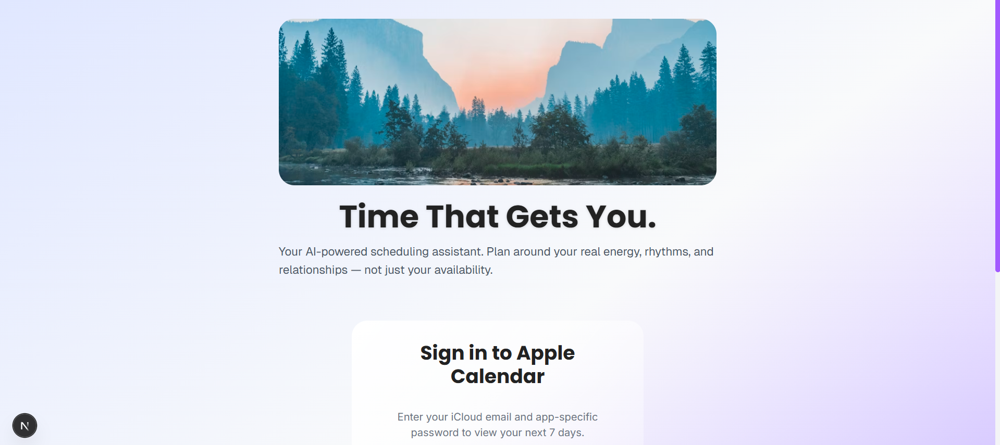
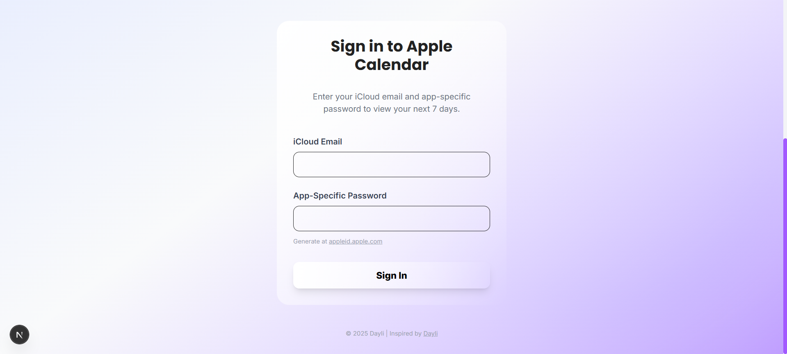

# Apple Calendar Integration Web App

> **A minimal, beautiful web app that connects to a user's Apple Calendar (iCloud) via CalDAV, allowing iCloud login with an app-specific password and displaying the next 7 days of events.**

---

## ✨ Features

- **iCloud Login:** Secure login using iCloud email and app-specific password.
- **CalDAV Integration:** Direct connection to Apple Calendar via CalDAV (no third-party APIs).
- **7-Day Event View:** Fetches and displays all events for the next 7 days.
- **Modern UI:** Dayli-inspired, responsive, and aesthetic interface.
- **No Third-Party Calendar APIs:** 100% compliant with the assignment requirements.

---

## 📸 Screenshots

1. **Landing/Login Page:**  
   
   
3. **Successful Event Display:**  
   
   
---

## 🚀 Getting Started

### 1. **Clone the Repository**
```bash
git clone https://github.com/sukanyaghosh74/apple-calendar.git
cd apple-calendar
```

### 2. **Backend Setup**
```bash
cd calendar-app/backend
npm install
npm run dev
```
- The backend will start on [http://localhost:4000](http://localhost:4000)

### 3. **Frontend Setup**
```bash
cd ../frontend
npm install
npm run dev
```
- The frontend will start on [http://localhost:3000](http://localhost:3000)

---

## 🔑 **How to Use**

1. **Generate an App-Specific Password:**
   - Go to [appleid.apple.com](https://appleid.apple.com/account/manage)
   - Under "Sign-In and Security," select "App-Specific Passwords" and generate a new one.

2. **Login:**
   - Enter your iCloud email and the app-specific password in the login form.

3. **View Events:**
   - After signing in, your Apple Calendar events for the next 7 days will be displayed in a beautiful, Dayli-themed interface.

---

## 🛡️ Security & Privacy

- **Credentials are never stored.** They are used only to fetch your calendar events via CalDAV and are not logged or saved.
- **No third-party calendar APIs** are used—only direct CalDAV access to Apple.

---

## 🛠️ Tech Stack

- **Frontend:** Next.js, React, Tailwind CSS, TypeScript
- **Backend:** Node.js, Express, TypeScript, [tsdav](https://github.com/natelindev/tsdav) (CalDAV client)
- **Design:** Inspired by [Dayli](https://usedayli.framer.website/)

---

## 📚 Assignment Compliance

- [x] iCloud login with app-specific password
- [x] CalDAV only (no third-party APIs)
- [x] Fetch and display next 7 days of events
- [x] Simple, beautiful UI
- [x] No OAuth/Google/Cronofy/Nylas/etc.
- [x] Clean, well-documented code

---

## 🙋‍♂️ Author

- **Sukanya Ghosh**
- [https://github.com/sukanyaghosh74](https://github.com/sukanyaghosh74)
- [sukanyaghosh2006@gmail.com](sukanyaghosh2006@gmail.com)

---

## 📄 License

This project is for the Dayli technical assignment and is not intended for production use.

## ⚠️ Caveats & Troubleshooting

While the event fetching system is fully implemented using Apple's official CalDAV protocol and the tsdav library, there are a few things to be aware of:

- **App-Specific Passwords:** Always use a fresh app-specific password generated from [appleid.apple.com](https://appleid.apple.com/account/manage). Expired or previously used passwords may not work.
- **iCloud Account Requirements:** Your iCloud account must have at least one calendar and some events in the next 7 days for results to appear.
- **2FA Required:** Two-factor authentication must be enabled on your Apple ID to generate app-specific passwords.
- **Network/Firewall Issues:** Some networks or firewalls may block CalDAV requests. If you encounter connection errors, try a different network.
- **Apple CalDAV Quirks:** Apple's CalDAV server can sometimes rate-limit or temporarily block requests, especially after multiple failed logins.
- **Event Parsing:** Rare or complex event formats (e.g., certain recurring events) may not display perfectly.
- **Region/Account Variations:** Some iCloud accounts (especially with non-standard regions or settings) may behave differently.

**If you encounter any issues:**
- Double-check your credentials and password freshness.
- Make sure you have events in your iCloud calendar for the next 7 days.
- Check backend logs for error messages.
- Feel free to contact me for troubleshooting or support!